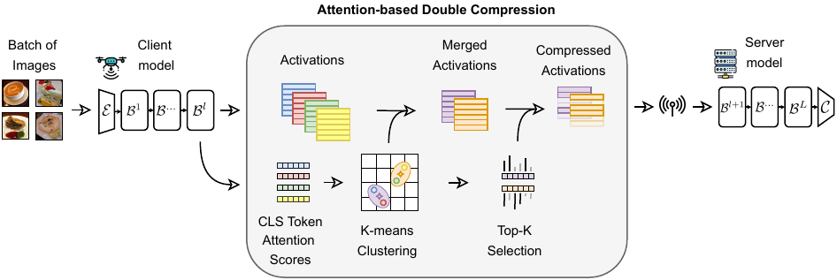
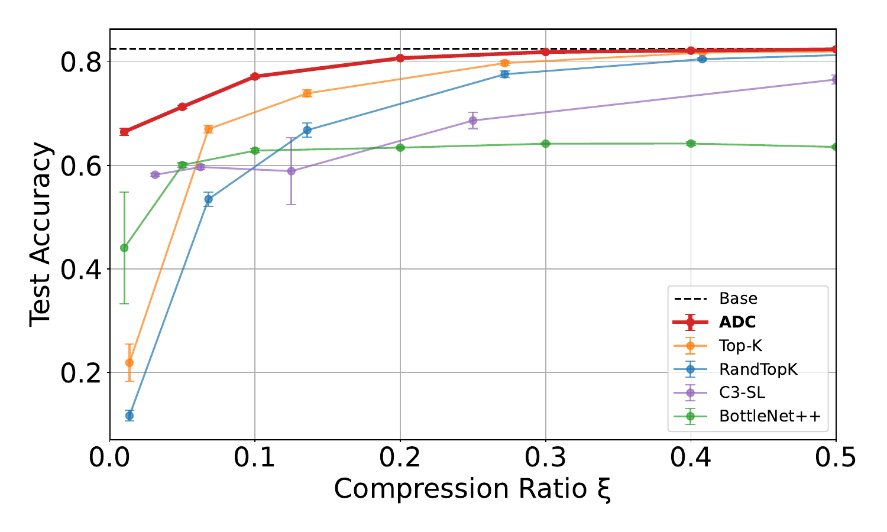
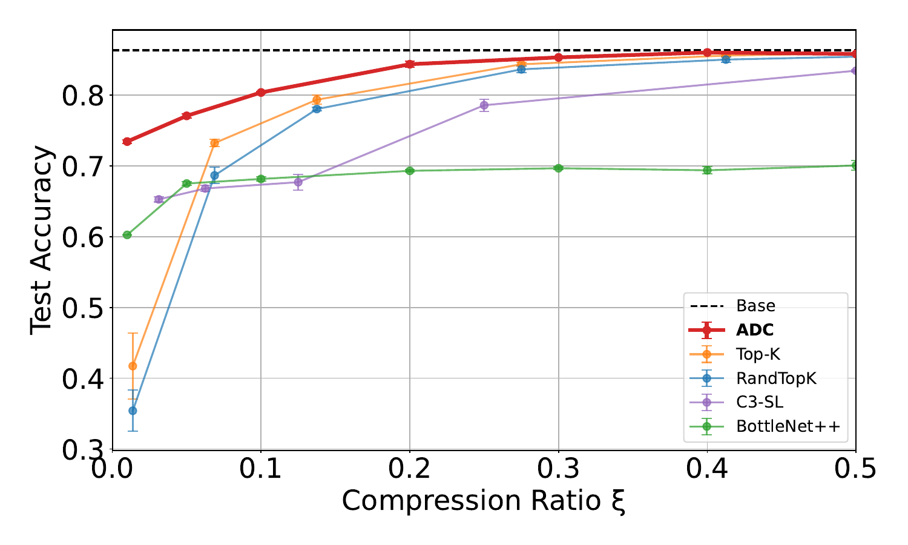
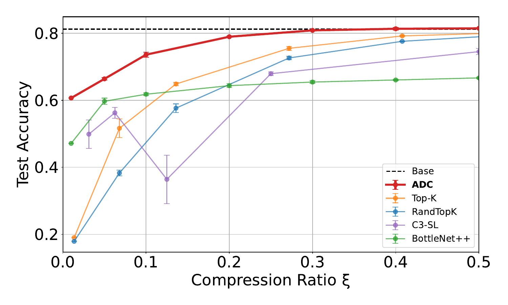
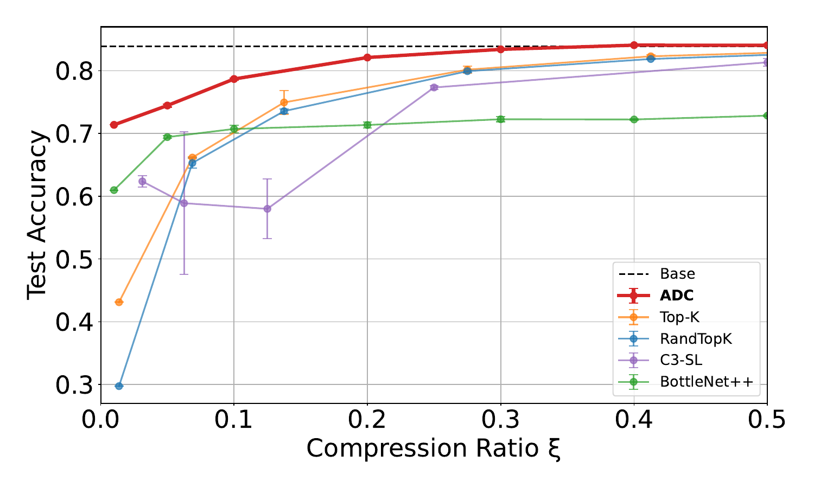

# Communication-Efficient Split Learning of ViTs<br>with Attention-based Double Compression

[](https://arxiv.org/pdf/2509.15058)
[](#citation)
[](LICENSE)

Official implementation of 

**["Communication Efficient Split Learning of ViTs with Attention-based Double Compression"](https://arxiv.org/pdf/2509.15058)**

by Federico Alvetreti, Jary Pomponi, Paolo Di Lorenzo, and Simone Scardapane.

---

## Table of contents

- [Highlights](#highlights)
- [Installation](#installation)
- [Data](#data)
- [Quickstart](#quickstart)
- [Reproducing the paper](#reproducing-the-paper)
- [Repository layout](#repository-layout)
- [Citation](#citation)
- [Acknowledgements](#acknowledgements)
- [License](#license)

---

## Highlights


- **ADC** — a dual-stream compression strategy for Split Learning of Vision Transformers that acts on both the **batch** and **token** dimensions.
- Clusters batch samples that share similar class-token attention patterns and replaces each cluster by its average activation.
- Prunes the merged activations down to the top-k tokens identified by each cluster centroid.
- Total compression ratio factorises as $\xi = (T/B)\cdot(k/n)$, giving a single dial that controls bandwidth.
- Maintains near-baseline accuracy at compression regimes where prior methods (BottleNet++, Top-K, Random Top-K, C3-SL) collapse.
- No extra parameters, no auxiliary training objectives, and implicit gradient compression for free.


|                   | DeiT-T                               | DeiT-S                                |
| ------------------| ------------------------------------ | ------------------------------------- |
| **CIFAR-100**     |         |         |
| **Food-101**      |         |         |

## Installation

```bash
conda env create -f environment.yaml
conda activate split-learning
```

The environment pins PyTorch 2.5 + CUDA 12, timm 1.0.14, Hydra 1.3.

## Data

```bash
python scripts/download_data.py
```

Downloads CIFAR-100 and Food-101 and caches the pretrained DeiT-T / DeiT-S weights.

## Quickstart

Train ADC on CIFAR-100 with DeiT-T at target compression $\xi = 0.1$:

```bash
python main.py method=adc dataset=cifar_100 model=deit_tiny_patch16_224 \
    method.parameters.compression=0.1
```

ADC also exposes the two underlying compression factors directly, if you want to step off the diagonal $T/B = k/n = \sqrt{\xi}$:

```bash
python main.py method=adc \
    method.parameters.batch_compression=0.4 \
    method.parameters.token_compression=0.6
```

## Reproducing the paper

The full sweep behind Figures 3 and 4 is wrapped in [`scripts/run_paper_experiments.sh`](scripts/run_paper_experiments.sh) — six methods × two models × two datasets × the compression sweep below × three seeds (`43422`, `51`, `114`).
FLOP measurements behind Figure 5 are produced by [`scripts/profile_flops.sh`](scripts/profile_flops.sh). 
The $(T/B,\,k/n)$ grid search visualised in Figure 2 was run with [`scripts/tune_adc.sh`](scripts/tune_adc.sh).

All runs below use `dataset={cifar_100, food_101}`, `model={deit_tiny_patch16_224, deit_small_patch16_224}`, and split point `l=3`.

<details>
<summary><b>Base (no compression)</b></summary>

```bash
python main.py method=base
```
</details>

<details>
<summary><b>BottleNet++</b></summary>

```bash
for c in 0.01 0.05 0.1 0.2 0.3 0.4 0.5; do
  python main.py method=bottlenet method.parameters.compression=$c
done
```
</details>

<details>
<summary><b>Top-K</b></summary>

```bash
for k in 0.01 0.05 0.1 0.2 0.3 0.4 0.5; do
  python main.py method=top_k method.parameters.rate=$k
done
```
</details>

<details>
<summary><b>Random Top-K</b></summary>

```bash
for k in 0.01 0.05 0.1 0.2 0.3 0.4 0.5; do
  python main.py method=random_top_k method.parameters.rate=$k
done
```
</details>

<details>
<summary><b>C3-SL</b></summary>

```bash
for R in 2 4 8 16 32; do
  python main.py method=c3_sl method.parameters.R=$R
done
```
</details>

<details>
<summary><b>ADC (ours)</b></summary>

```bash
for c in 0.01 0.05 0.1 0.2 0.3 0.4 0.5; do
  python main.py method=adc method.parameters.compression=$c
done
```
</details>

## Repository layout

```
.
├── main.py                       Training entry point (Hydra)
├── configs/                      Hydra config groups
│   ├── default.yaml
│   ├── communication/{clean,noisy}.yaml
│   ├── dataset/{cifar_100,food_101}.yaml
│   ├── method/{base,bottlenet,c3_sl,top_k,random_top_k,adc}.yaml
│   ├── model/{deit_tiny,deit_small}_patch16_224.yaml
│   └── optimizer/adam.yaml
├── methods/                      Compression methods
├── comm/communication.py         Clean / Gaussian-noise channels
├── scripts/
│   ├── download_data.py
│   ├── run_paper_experiments.sh
│   ├── profile_flops.sh
│   ├── tune_adc.sh
│   └── slurm/                    CINECA / Leonardo job templates
└── tools/compute_flops.py        FLOP profiler
```

## Citation

If you find this work useful, please cite:

```bibtex
@inproceedings{alvetreti2026adc,
  title     = {Communication Efficient Split Learning of {ViTs} with
               Attention-based Double Compression},
  author    = {Alvetreti, Federico and Pomponi, Jary and
               Di Lorenzo, Paolo and Scardapane, Simone},
  booktitle = {Proceedings of the 34th European Signal Processing Conference
               (EUSIPCO)},
  year      = {2026},
}
```

## Acknowledgements

This work has been supported by:

1. SNS JU project **6G-GOALS** under the EU's Horizon program, Grant Agreement No. 101139232.
2. Sapienza grant **RG123188B3EF6A80 (CENTS)**, by the European Union under the Italian National Recovery and Resilience Plan of NextGenerationEU, partnership on Telecommunications of the Future (PE00000001 — program RESTART).
3. *Sapienza, Avvio alla ricerca* grant (UGOV 1201260).

We also acknowledge **ISCRA** for awarding this project access to the **LEONARDO** supercomputer, owned by the EuroHPC Joint Undertaking and hosted by CINECA (Italy).

## License

This project is released under the [MIT License](LICENSE).

---

**Corresponding author:** Federico Alvetreti — <federico.alvetreti@uniroma1.it>
